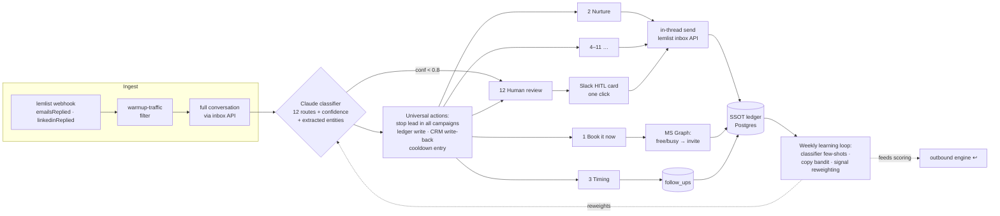

# Route → Act → Learn

### An agentic reply engine for outbound — 12 routes, 1 human, everything on the ledger

Every outbound team obsesses over the send and improvises the reply. Copy gets A/B-tested to death; then a prospect actually answers and the message sits in an inbox for 26 hours, gets a hand-typed response of wildly variable quality, and never makes it into any system you can audit or learn from.

This is the other half of the machine. **[signal-driven-outbound](https://github.com/Miksh21/signal-driven-outbound) decides who to message and when; this engine handles everything that comes back** — classifies every reply into one of **12 routes**, acts on 11 of them autonomously (in-thread replies, calendar invites, referral enrollment, scheduled re-engagement, suppression), escalates exactly one to a human, writes every word sent and received into a Postgres ledger, and re-reads its own outcomes weekly to get better.

The use case was the same B2B recruitment agency's outbound (Czech-language market — which matters, see [guardrails](docs/guardrails.md)). Strip the labels and it's any reply-heavy lifecycle: swap *"wrong person, talk to our HR lead"* for *"talk to procurement"* and it's your inbox.

> Anonymized case study. No client data, names, or message content from the live system — this is the architecture and the thinking. Reference code in [`examples/`](examples/) is illustrative, not a drop-in product.

---

## The problem, concretely

The outbound engine (sibling repo) fixed *who and when*. Then the replies exposed the next bottleneck:

- **Reply latency was measured in days, not hours** — and interest decays fast. A "can you do Thursday?" answered on Friday is a lost meeting.
- **Reply handling was invisible.** Sent from personal inboxes, no CRM trace, no way to ask "what did we tell this account last quarter?"
- **Every reply was handled from scratch** — no taxonomy, no playbook, no learning. The same objection got five different answers from five senders.
- **The "automation" available off the shelf was binary**: auto-send everything (reputational roulette) or human-review everything (the bottleneck you started with).

So the rebuild treats **the reply as a routing problem, not a writing problem**. Writing is the easy 20%; deciding *which of 12 situations you're in* — and what the system should do about it with no human watching — is the hard 80%.

---

## The machine

Five moving parts:

1. **Ingest** — lemlist webhooks trigger; the inbox API supplies the *full conversation* (webhook payloads don't carry bodies — verified against the API spec, not assumed). A warmup-traffic filter runs first, because warmup emails classified as replies will flood your CRM. Ask me how I know.
2. **Classifier** — one LLM call returns route (1–12), confidence, and extracted entities (a proposed meeting time, a referral's name, an out-of-office return date). Below 0.8 confidence → forced to route 12. The prompt carries retrieved few-shot examples of *past human corrections* — the classifier improves weekly without fine-tuning ([learning loop](docs/learning-loop.md)).
3. **Router** — 12 branches, each fully specified: what to send, through which channel, what to schedule, when to give up ([routes](docs/routes.md)). Replies go out on the channel the prospect used — a LinkedIn reply gets a LinkedIn answer.
4. **Ledger** — every message, in both directions, is a Postgres row *before* it's a sent email. Outbound campaign copy is materialized at enroll time; agent replies are write-ahead logged; a nightly reconciliation sweep catches what webhooks dropped. Hybrid full-text + vector search makes the whole history plain-English queryable ([ledger](docs/ledger.md)).
5. **Learning loop** — weekly job joins decisions to outcomes and adjusts three things: classifier examples, copy-variant weights, and the signal weights feeding the *outbound* engine's scoring. The loop the sibling repo listed as "planned" is this ([learning loop](docs/learning-loop.md)).

---

## The 12 routes, in one table

Full specifications with example replies, waiting windows, and required assets in [docs/routes.md](docs/routes.md).

| # | Route | Autonomous action | Human? |
|---|---|---|---|
| 1 | Book it now | Free/busy check → calendar invite sent as the thread's sender → confirmation in-thread | no |
| 2 | Nurture ("tell me more") | ONE qualifying question in-thread; bump after 4 business days of silence | no |
| 3 | Timing ("maybe Q3") | Warm confirm; scheduled re-engagement with suppression re-check at fire time | no |
| 4 | Hard no / unsubscribe | Silence + unsubscribe list + account-level suppression | no |
| 5 | Soft not-interested | Two-sentence warm close; 9-month cooldown; aggregate rate flags targeting problems | no |
| 6 | Incumbent ("we use X") | One probe question about whether X actually works; never attacks the vendor | no |
| 7 | Send more info | One paragraph + one tracked link + one qualifying question | no |
| 8 | Referral | Thank referrer in-thread; resolve referred person; enroll in referral campaign next business day | no |
| 9 | "Nothing in this space now" | Plant-a-flag question; account moves to signal-watch — a fresh buying signal re-activates it | no |
| 10 | Out of office | Parse return date; pause; resume same campaign, same step, return + 2 days | no |
| 11 | Spam / bounce / invalid | Stop, mark invalid, feed list hygiene | no |
| 12 | Ambiguous / low confidence | **Slack card: reply + suggested draft + [Send] [Edit] [Close]** | **one click** |

The autonomy boundary is deliberate: routes 1–11 are situations with a *correct playbook* — executing it fast beats executing it thoughtfully. Route 12 is everything without one. The Slack card ([live HTML mock](diagrams/hitl-card.html)) stages the entire decision so the human contribution is literally one click — and that click becomes training data.

---

## What keeps "fully agentic" from becoming "fully embarrassing"

Six guardrails, detailed in [docs/guardrails.md](docs/guardrails.md):

1. **Two-turn rule** — the agent holds at most 2 conversational turns per thread; the 3rd inbound message auto-escalates to route 12. An agent that argues with prospects is worse than no agent.
2. **Confidence gate** — < 0.8 → human, no exceptions. Misrouting a hard-no as nurture is the reputational worst case.
3. **Warmup filter** — warmup traffic is excluded before classification, not after.
4. **Humanizer** — randomized 5–20 min send delay, business hours only, never weekends. Instant replies scream bot.
5. **Suppression re-check at every send point** — not just at classification. A follow-up scheduled for Q3 re-gates before firing; the account may have said no to another sender meanwhile.
6. **Language guardrails** — Czech morphology (vocative case, gender-matched verb forms) is handled by the LLM per-message inside template constraints, never by regex. The fastest way to sound like a bot in a Slavic language is to get a name declension wrong.

---

## What's in this repo

| Path | What it is |
|---|---|
| [docs/architecture.md](docs/architecture.md) | The 5-workflow decomposition, the two-mouths design (campaigns vs. conversations), calendar integration scope |
| [docs/routes.md](docs/routes.md) | All 12 routes fully specified — triggers, actions, waiting windows, required assets |
| [docs/ledger.md](docs/ledger.md) | Message ledger design: capture paths, write-ahead logging, reconciliation, hybrid search |
| [docs/learning-loop.md](docs/learning-loop.md) | Decisions→outcomes joins, the three learning surfaces, tiered autonomy |
| [docs/guardrails.md](docs/guardrails.md) | The six guardrails, with failure modes each one prevents |
| [docs/decisions.md](docs/decisions.md) | Architecture decision records — including the ones that were wrong first |
| [examples/schema.sql](examples/schema.sql) | The full ledger schema: messages, conversations, decisions, outcomes, variants, learnings + hybrid search function |
| [examples/classifier_prompt.md](examples/classifier_prompt.md) | The 12-route classification prompt, output contract, few-shot correction retrieval |
| [examples/router.py](examples/router.py) | Reference implementation of the dispatch: guardrails → route → actions |
| [examples/slack_hitl_card.json](examples/slack_hitl_card.json) | Route 12 Slack card as Block Kit JSON |
| [diagrams/hitl-card.html](diagrams/hitl-card.html) | The HITL card rendered — open in a browser |

---

## Stack

**lemlist** (sequencer + unified inbox API — email, LinkedIn, WhatsApp sends through one surface) · **n8n** (self-hosted orchestration, 5 workflows) · **Postgres/Supabase** (ledger, scheduling, learning state, pgvector) · **Claude** (classification + drafting) · **Microsoft Graph** (calendar only: free/busy + invites — deliberately *not* mail; see [decisions](docs/decisions.md)) · **lemcal** (self-serve booking fallback) · the CRM (write-back on every touch).

## Siblings

- **[signal-driven-outbound](https://github.com/Miksh21/signal-driven-outbound)** — the outbound half: signals scored by weight × decay × stacking, gated, routed. This repo consumes its scoring and feeds its reweighting.
- **[duvo-reply-intelligence](https://github.com/Miksh21/duvo-reply-intelligence)** — an earlier, deliberately HITL-first reply handler (human approves every send). This engine is the fully-agentic evolution of that design: the human gate moved from *every send* to *one route*.

---

*MIT licensed. Architecture case study — the live system it describes is private.*
